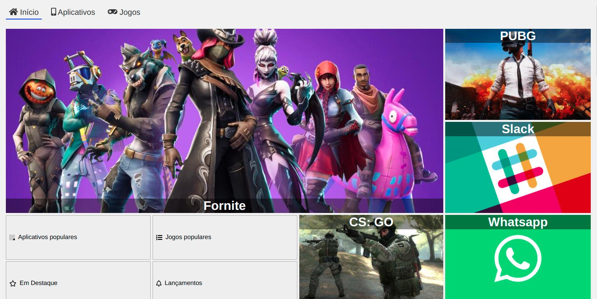
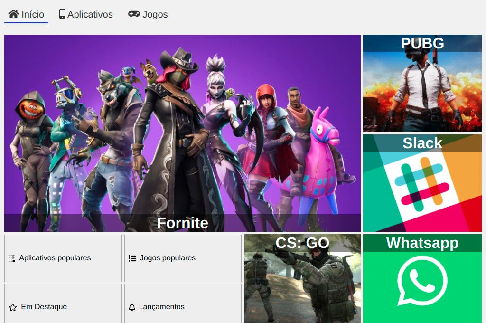

# Alura Store

- Layout Desktop:

- Layout Laptop:

- Layout Tablet:

- Layout Mobile 375px de largura:

- Layout Mobile 320px de largura:

## Descrição:

Projeto desenvolvido no curso CSS Grid: simplificando layouts. O intuito do curso foi se aprofundar no display: grid; do CSS, sendo usado em quase tudo da página, juntamente com o display: flex; para posicionar os elementos. Alguns pedaços de códigos HTML foram disponibilizados como base para focarmos no conteúdo do curso, mas me coloquei como desafio fazer cada atualização que tivesse no código manualmente, sem copiar e colar. Também me coloquei como desafio criar um menu hambúrguer na versão mobile da página, usando JavaScript junto com CSS para isso. Gostei muito de desenvolver esse projeto e me sinto muito mais confiante em todo o meu conhecimento de HTML, CSS e JavaScript. Espero que gostem! :)